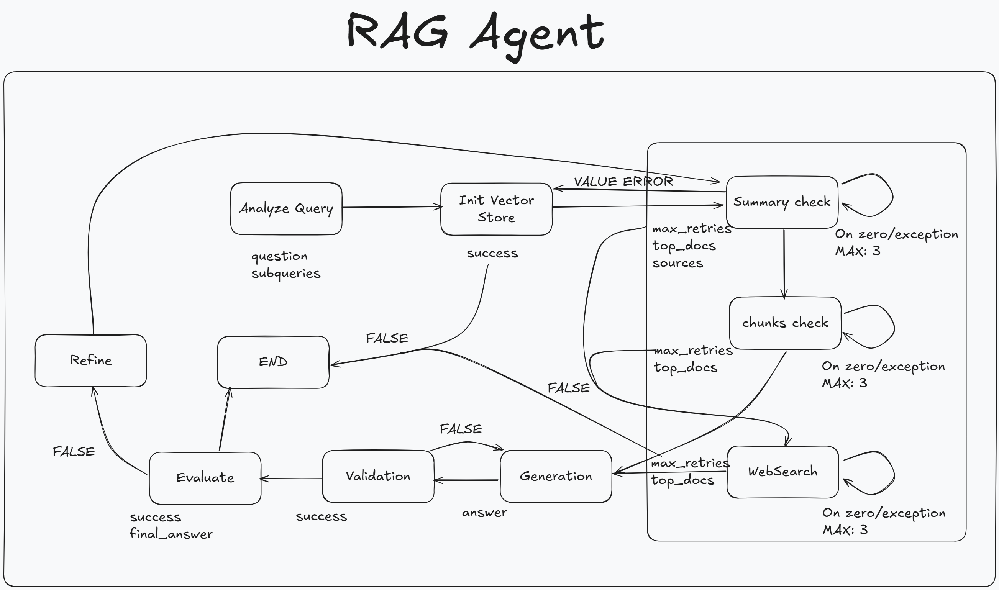

# 🧠 RAG Agent using LangGraph & LangChain

This project is a **Retrieval-Augmented Generation (RAG) Agent** built with:

- 🔁 **LangGraph**: for orchestrating recursive retrieval using conditional edges  
- 🦜 **LangChain**: to integrate vector stores, embeddings, memory, and agents  
- 🧭 **Tavily Search**: to augment answers with live web results  
- 🤖 **Anthropic Claude API**: as the core LLM (e.g., Claude 3.5)  
- 🔍 **FAISS**: for efficient local semantic retrieval  
- 💡 **HuggingFace Embeddings**: to embed documents and queries for semantic search

---

## ✨ Features

- **Agent-centric architecture**: all logic encapsulated in a single `Agent` class
- Simple querying interface:  
    ```python
    agent.query("What is attention?")
    ```
- Recursive document retrieval via **LangGraph** conditional edges
- Seamless integration with **Tavily Search API** for real-time information
- Modular design for easy **extensibility and integration**

---

## 🗂️ Project Structure
```.
├── app/        # Main Agent module: query processing & orchestration
│   ├── utils/
│   │   ├── document_processor.py   # Read/chunk documents tool
│   │   ├── summary_manager.py      # Summary generating tool
│   │   ├── query_analyzer.py       # Query analysis and breakdown tool
│   │   └── logging_config.py       # Logging setup
│   ├── store/
│   │   └── vector_store.py     # FAISS-based vector store logic using LangChain
│   ├── graph/
│   │   └── workflow.py     # LangGraph setup with conditional edges
│   └── core/
│       ├── config.py       # Pydantic config facade
│       ├── state.py        # Graph variables/states
│       ├── agent.py        # Agent class
│       └── settings/
│               ├── .env.template   # .env template
│               └── .env    # API keys, settings, and constants
│
├── documents/              # Source documents to embed
├── test.py                 # Example runner script
├── requirements.txt
└── README.md
```

---

## 🚀 Getting Started
### 1. Install Requirements
```bash
pip install -r requirements.txt
```
Make sure the following packages are included:
- ```langchain```
- ```langgraph```
- ```faiss-cpu or faiss-gpu```
- ```huggingface_hub```
- ```anthropic```

Will be in the future version, now we use LangChain
- ```tavily-python```

### 2. Set Environment Variables
1. Paste your variables into .env that can be created in **the same folder and the same format** as _.env.template_
2. Use ```test.py``` as basic example
    ```python
    import asyncio
    from app import RAGAgent
    from app import setup_logging
    
    async def main():
        setup_logging()
        
        # Initialize agent
        agent = RAGAgent()
        documents = "./documents"
        question = "What is attention"
        result = await agent.query(question, documents)
    
    asyncio.run(main())
    ```

---

## 🧠 Workflow

- Uses **LangChain FAISS** to perform local document retrieval
- Embeds documents and queries using **HuggingFace** embedding models
- Implements recursive retrieval with **LangGraph** conditional edge logic
- Falls back to **Tavily Search** when local results are insufficient
- Combines all context and queries **Anthropic Claude API** for final response and summaries


---

## 🛠️ Customization
All files are modules within my flow, so you there are no direct dependancies.
Follow functions names and return type, you can change every part.
For example:
- VectorStore can be created using llama_index
- Workflow can be redirected or new nodes/edges initialized
- Document preprocessing customized and different extensions added

---

## 📌 TODO
- Add UI (Streamlit, Gradio)
- Introduce feedback loop (Reinforcement Learning)
- Support multi-turn conversational memory
- Support documents filtering by masks
- Better evaluation technique (fuzzy match)
- Workflow nuances (retries, loops, web_search)
- Add automatization on docker

---

Main developer: @kapalaq